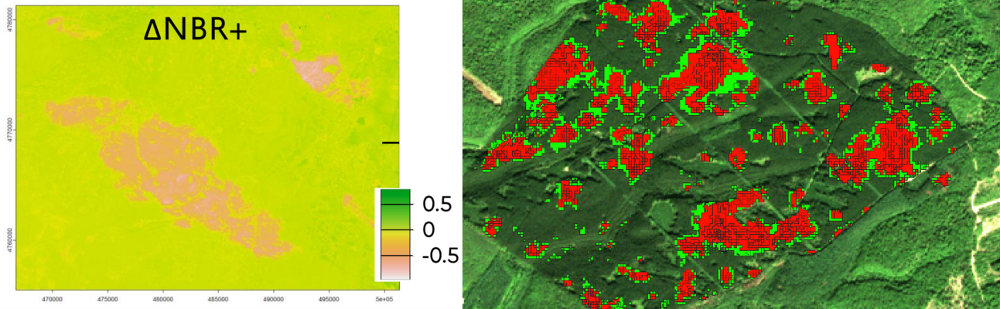
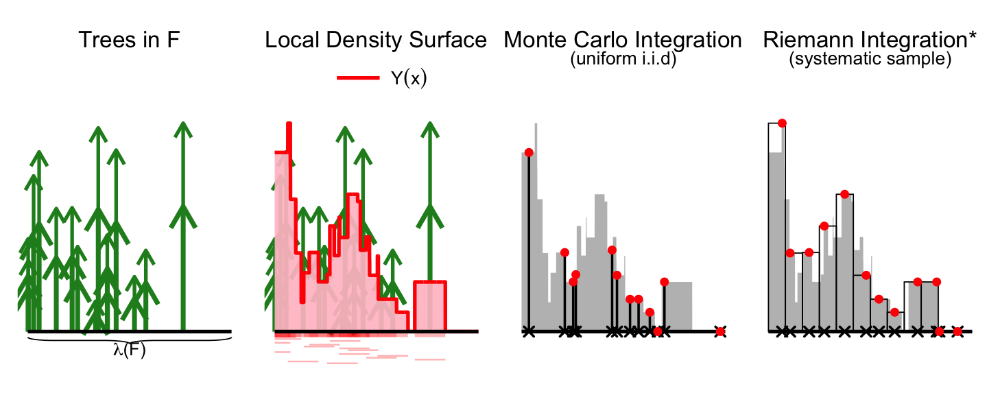
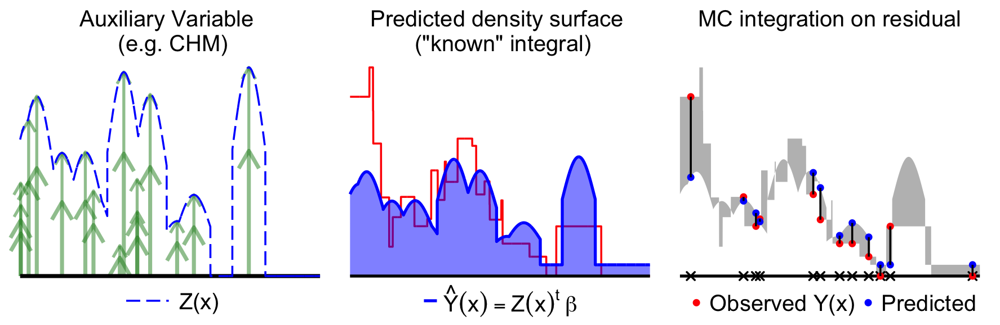
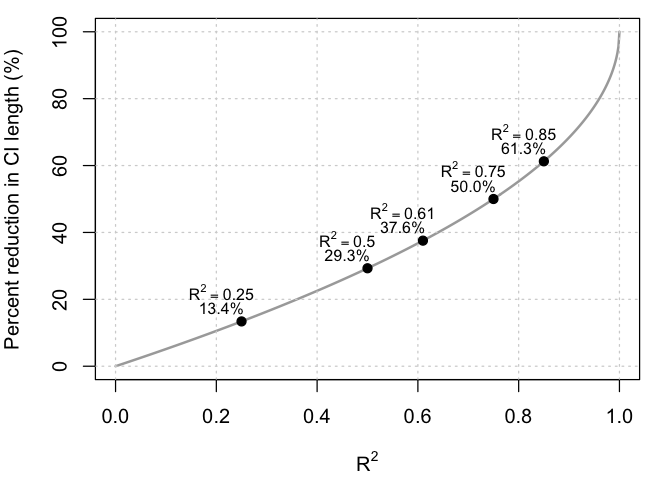
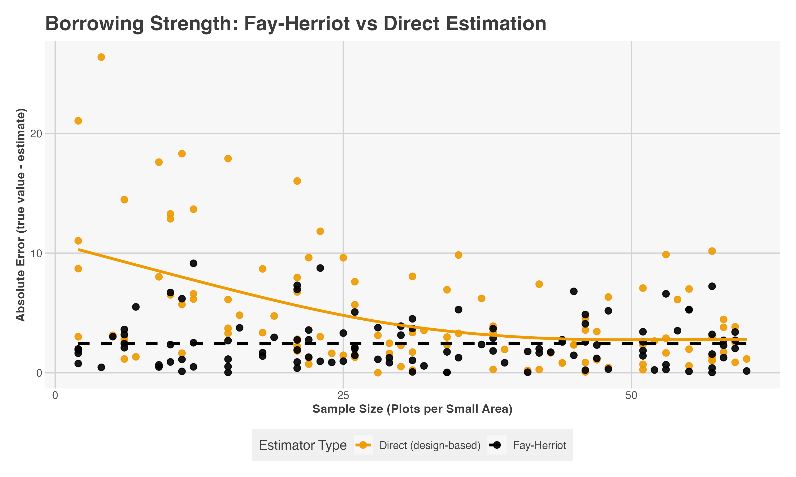

```{=html}
<style>

/* ── Typography & base ── */
body {
  font-size: 16px;
  line-height: 1.75;
  color: #3d3d3a;
}

h1.title {
  font-size: 26px;
  font-weight: 500;
  line-height: 1.3;
  margin-bottom: 0.4rem;
}

h2 {
  font-size: 20px;
  font-weight: 500;
  margin-top: 2.5rem;
  margin-bottom: 0.8rem;
  color: #1a1a18;
  border-bottom: 0.5px solid #e0ded6;
  padding-bottom: 0.4rem;
}

h3 {
  font-size: 16px;
  font-weight: 500;
  margin-top: 1.6rem;
  margin-bottom: 0.5rem;
  color: #2c2c2a;
}

p {
  margin-bottom: 1rem;
}

/* ── Keyword pills ── */
.pill-row {
  display: flex;
  flex-wrap: wrap;
  gap: 6px;
  margin: 1rem 0 1.5rem;
}

.pill {
  font-size: 11px;
  padding: 3px 11px;
  border-radius: 20px;
  font-weight: 500;
}

.pill-green  { background: #EAF3DE; color: #3B6D11; }
.pill-blue   { background: #E6F1FB; color: #185FA5; }
.pill-amber  { background: #FAEEDA; color: #854F0B; }
.pill-purple { background: #EEEDFE; color: #534AB7; }
.pill-teal   { background: #E1F5EE; color: #0F6E56; }

/* ── Callout boxes ── */
.callout-teal {
  border-left: 3px solid #5DCAA5;
  background: #E1F5EE;
  border-radius: 0 8px 8px 0;
  padding: 1rem 1rem;
  margin: 1rem 0;
  color: #085041;
  font-size: 14px;
}

.callout-amber {
  border-left: 3px solid #EF9F27;
  background: #FAEEDA;
  border-radius: 0 8px 8px 0;
  padding: 1rem 1.25rem;
  margin: 1.5rem 0;
  color: #633806;
  font-size: 14px;
}

.callout-purple {
  border-left: 3px solid #AFA9EC;
  background: #EEEDFE;
  border-radius: 0 8px 8px 0;
  padding: 1rem 1.25rem;
  margin: 1.5rem 0;
  color: #3C3489;
  font-size: 14px;
}

/* ── Figure boxes ── */
.fig-box {
  background: #f6f5f0;
  border: 0.5px solid #d3d1c7;
  border-radius: 12px;
  padding: 1.5rem;
  margin: 1.5rem 0;
}

.fig-placeholder {
  min-height: 160px;
  display: flex;
  align-items: center;
  justify-content: center;
  background: #edecea;
  border-radius: 8px;
  border: 1px dashed #b4b2a9;
  color: #888780;
  font-size: 13px;
  font-style: italic;
  text-align: center;
  padding: 1rem;
}

.fig-caption {
  font-size: 12px;
  color: #888780;
  margin-top: 0.75rem;
  font-style: italic;
}

/* ── Math display ── */
.math-display {
  text-align: center;
  margin: 1.25rem 0;
  font-size: 16px;
  font-style: italic;
  font-family: Georgia, serif;
  background: #f6f5f0;
  border-radius: 8px;
  padding: 0.6rem 1rem;
  display: block;
}

/* ── Code blocks ── */
pre.r-pseudo {
  background: #f6f5f0;
  border: 0.5px solid #d3d1c7;
  border-radius: 8px;
  padding: 1.25rem;
  font-family: monospace;
  font-size: 13px;
  line-height: 1.7;
  overflow-x: auto;
  color: #3d3d3a;
}

.code-label {
  font-size: 11px;
  font-weight: 500;
  text-transform: uppercase;
  letter-spacing: 0.06em;
  color: #888780;
  margin-bottom: 0.4rem;
}

/* ── Task grid ── */
.task-grid {
  display: grid;
  grid-template-columns: repeat(auto-fit, minmax(200px, 1fr));
  gap: 12px;
  margin: 1.2rem 0;
}

.task-card {
  background: #fff;
  border: 0.5px solid #d3d1c7;
  border-radius: 12px;
  padding: 0.9rem 1rem;
}

.task-icon { font-size: 18px; margin-bottom: 0.4rem; }
.task-title { font-size: 13px; font-weight: 500; color: #1a1a18; margin-bottom: 0.25rem; }
.task-desc  { font-size: 12px; color: #5f5e5a; line-height: 1.5; }

/* ── Info row ── */
.info-row {
  display: flex;
  flex-wrap: wrap;
  gap: 12px;
  margin: 0.75rem 0;
}

.info-card {
  flex: 1;
  min-width: 130px;
  background: #f6f5f0;
  border-radius: 8px;
  padding: 0.75rem 1rem;
}

.info-label {
  font-size: 11px;
  text-transform: uppercase;
  letter-spacing: 0.06em;
  font-weight: 500;
  color: #888780;
  margin-bottom: 0.3rem;
}

.info-val {
  font-size: 15px;
  font-weight: 500;
  color: #1a1a18;
}

/* ── Closing block ── */
.closing {
  background: #f6f5f0;
  border: 1px solid #e2dfd4;
  border-radius: 10px;
  padding: 0.8rem 1rem;
  transition: all 0.15s ease;
}

.closing-quote {
  font-size: 18px;
  font-weight: 500;
  line-height: 1.45;
  color: #1a1a18;
  margin-bottom: 0.75rem;
}

.closing p {
  font-size: 14px;
  color: #5f5e5a;
}

hr.section-divider {
  border: none;
  border-top: 0.5px solid #d3d1c7;
  margin: 2.5rem 0;
}

/* ── Partner cards layout fix ── */
.task-card {
  display: flex;
  flex-direction: column;
  align-items: stretch;
}

/* ── Logo container (ensures same height + centering) ── */
.partner-logo {
  height: 60px;
  width: 100%;
  object-fit: contain;
  display: block;
  margin: 0 auto 0.8rem auto;
}

/* ── Title alignment ── */
.task-title {
  margin-top: 0.2rem;
}

.task-desc {
  margin-top: 0.4rem;
}

/* ── Full-width PEPR card ── */
.full-width-card {
  grid-column: 1 / -1;
  padding: 0.3rem 2rem;
}

/* ── PEPR layout (logo left, text right) ── */
.pepr-row {
  display: flex;
  align-items: center;
  gap: 1.5rem;
}

/* ── Larger logo ── */
.pepr-logo {
  height: 80px;
  width: auto;
  object-fit: contain;
}

/* ── Text block ── */
.pepr-text {
  flex: 1;
}

.pepr-text .task-title {
  margin-bottom: 0.4rem;
}

.task-desc a {
  color: #0066cc;
  text-decoration: none;
}
.task-desc a:hover {
  text-decoration: underline;
}

/* ── Figure layout (center + full width) ── */
.fig-row {
  display: flex;
  justify-content: center;
}

.fig-col {
  width: 100%;
  display: flex;
  justify-content: center;
  align-items: center;
}

/* ── Images fill the box ── */
.fig-col img {
  width: 100%;
  height: auto;
  max-width: 100%;
  border-radius: 8px;
  border: 0.5px solid #d3d1c7;
  display: block;
}

.team-grid {
  display: grid;
  grid-template-columns: 1fr 1fr;
  gap: 20px;
  margin-top: 2rem;
}
@media (max-width: 768px) {
  .team-grid { grid-template-columns: 1fr; }
}
.task-meta {
  font-size: 0.9rem;
  color: #2c3e50;
  margin-bottom: 0.5rem;
}
.task-tags {
  font-size: 0.85rem;
  color: #7f8c8d;
  margin-top: 10px;
  border-top: 1px solid #eee;
  padding-top: 5px;
}

.black-link {
  color: black;
  text-decoration: underline;
}
.black-link:hover {
  text-decoration: none;
}

/* ── Accordion details/summary ── */
details.accordion {
  margin: 0.45rem 0;
  border: 0.5px solid #d3d1c7;
  border-radius: 10px;
  background: linear-gradient(135deg, #d9ead3 0%, #faeeda 130%);
  padding: 0.8rem 1rem;
}

summary {
  font-size: 18px;
  font-weight: 500;
  cursor: pointer;
  list-style: none;
  user-select: none;
}

summary::-webkit-details-marker {
  display: none;
}

summary::after {
  content: "▸";
  float: right;
  transition: transform 0.2s ease;
}

details[open] summary::after {
  transform: rotate(90deg);
}

.info-card {
  background: #f6f5f0;
  border: 1px solid #e2dfd4;
  border-radius: 10px;
  padding: 0.8rem 1rem;
  transition: all 0.15s ease;
}

.info-card:hover {
  border-color: #cfcbbd;
  background: #fcfbf8;
}

.info-label {
  font-size: 11px;
  text-transform: uppercase;
  letter-spacing: 0.06em;
  font-weight: 500;
  color: #7a7972;
  margin-bottom: 0.25rem;
}

.info-val {
  font-size: 15px;
  font-weight: 500;
  color: #1f1f1c;
  line-height: 1.4;
}
</style>
```

# Small Area Estimation for High-Resolution Monitoring of Forest Disturbances with Bayesian Spatiotemporal Smoothing
**PhD Opportunity**

<!-- ── HEADER / KEYWORDS ── -->

::: pill-row
[Forest inventory]{.pill .pill-green} [Survey sampling]{.pill .pill-blue} [Small area estimation]{.pill .pill-amber} [Bayesian / INLA]{.pill .pill-purple} [Remote sensing]{.pill .pill-teal}
:::

```{=html}
<div class="info-section">

  <div class="info-row info-row-primary">
    <div class="info-card">
      <div class="info-label">Location</div>
      <div class="info-val">Nancy, France</div>
    </div>
    <div class="info-card">
      <div class="info-label">Duration</div>
      <div class="info-val">3 years</div>
    </div>
    <div class="info-card">
      <div class="info-label">Salary (gross)</div>
      <div class="info-val">~€2 300/month</div>
    </div>
    <div class="info-card">
      <div class="info-label">Start</div>
      <div class="info-val">Sep–Oct 2026</div>
    </div>
  </div>

  <div class="info-row info-row-secondary">
    <div class="info-card">
      <div class="info-label">Social benefits</div>
      <div class="info-val">Public healthcare + education + full worker protections</div>
    </div>
    <div class="info-card">
      <div class="info-label">Workplace perks</div>
      <div class="info-val">Subsidized meals + commute reimbursement</div>
    </div>
    <div class="info-card">
      <div class="info-label">Research funding</div>
      <div class="info-val">International conference travel</div>
    </div>
    <div class="info-card">
      <div class="info-label">Application deadline</div>
      <div class="info-val">Open until filled</div>
    </div>
  </div>

</div>
```

<details class="accordion">

<summary><strong>Partners & Funding</strong></summary>

```{=html}
<div class="task-grid">

  <div class="task-card full-width-card pepr-card">
    <div class="pepr-row">
      
      <div class="pepr-text">
        <div class="task-title" style="text-decoration: underline;">Co-funder</div>
        <div class="task-desc">
          <p><strong><a href="https://www.pepr-forestt.org/eng" target="_blank" rel="noopener noreferrer" style="color: black; text-decoration: none;">PEPR FORESTT</a></strong> is a national research initiative funded by <a href="https://anr.fr/en/france-2030/france-2030/" target="_blank" rel="noopener noreferrer" style="color: black; text-decoration: none;">France 2030</a>. It brings together a consortium of leading French institutions, including <a href="https://www.inrae.fr/" target="_blank" rel="noopener noreferrer" style="color: black; text-decoration: none;">INRAE</a>, <a href="https://www.univ-pau.fr/" target="_blank" rel="noopener noreferrer" style="color: black; text-decoration: none;">Université de Pau et des Pays de l'Adour</a>, <a href="https://www.agroparistech.fr/" target="_blank" rel="noopener noreferrer" style="color: black; text-decoration: none;">AgroParisTech</a>, <a href="https://www.purpan.fr/" target="_blank" rel="noopener noreferrer" style="color: black; text-decoration: none;">Ecole d'Ingénieur de Purpan</a>, <a href="https://www.univ-amu.fr/" target="_blank" rel="noopener noreferrer" style="color: black; text-decoration: none;">Aix-Marseille Université</a>, <a href="https://www.onf.fr/" target="_blank" rel="noopener noreferrer" style="color: black; text-decoration: none;">ONF</a>, <a href="https://www.cirad.fr/" target="_blank" rel="noopener noreferrer" style="color: black; text-decoration: none;">CIRAD</a>, <a href="https://www.cnrs.fr/" target="_blank" rel="noopener noreferrer" style="color: black; text-decoration: none;">CNRS</a>, <a href="https://www.ird.fr/" target="_blank" rel="noopener noreferrer" style="color: black; text-decoration: none;">IRD</a>, <a href="https://www.ign.fr/" target="_blank" rel="noopener noreferrer" style="color: black; text-decoration: none;">IGN</a>, and <a href="https://www.parcs-naturels-regionaux.fr/centre-national-de-la-propriete-forestiere-cnpf" target="_blank" rel="noopener noreferrer" style="color: black; text-decoration: none;">CNPF</a>. This interdisciplinary program aims to advance our understanding, monitoring, and management of forests in the face of climate change and increasing disturbance risks.
        </div>
      </div>
    </div>
  </div>

  <div class="task-card">
    
    <div class="task-title" style="text-decoration: underline;">Coordinator institution</div>
    <div class="task-desc">
      The <a href="https://www.inrae.fr/" target="_blank" rel="noopener noreferrer" style="color: black; text-decoration: none;">Institut national de recherche pour l'agriculture, l'alimentation et l'environnement (INRAE)</a> coordinates the <strong><a href="https://www.pepr-forestt.fr/eng/projects/x-risks" target="_blank" rel="noopener noreferrer" style="color: black; text-decoration: none;">X-RISKS</a></strong> project within the PEPR FORESTT programme. The project aims to study and anticipate the multiple, extreme risks threatening forests under climate change.
    </div>
  </div>

  <div class="task-card">
    
    <div class="task-title" style="text-decoration: underline;">Co-funder</div>
    <div class="task-desc">
      The <a href="https://www.ign.fr/" target="_blank" rel="noopener noreferrer" style="color: black; text-decoration: none;">Institut national de l'information géographique et forestière (IGN)</a> is responsible for the French National Forest Inventory. It produces high-resolution forest monitoring outputs by integrating field surveys with geospatial data.
    </div>
  </div>

  <div class="task-card">
    
    <div class="task-title" style="text-decoration: underline;">Degree awarding institution</div>
    <div class="task-desc">
      The candidate will be enrolled in the <a href="https://doctorat.univ-lorraine.fr/en/doctoral-schools/sirena" target="_blank" rel="noopener noreferrer" style="color: black; text-decoration: none;">SIReNa doctoral school (Sciences et Ingénierie des Ressources Naturelles)</a>, bringing together laboratories from <a href="https://www.univ-lorraine.fr/en/univ-lorraine/" target="_blank" rel="noopener noreferrer" style="color: black; text-decoration: none;">Université de Lorraine</a>, <a href="https://www.inrae.fr/" target="_blank" rel="noopener noreferrer" style="color: black; text-decoration: none;">INRAE</a>, <a href="https://www.cnrs.fr/" target="_blank" rel="noopener noreferrer" style="color: black; text-decoration: none;">CNRS</a>, and <a href="https://www.agroparistech.fr/en" target="_blank" rel="noopener noreferrer" style="color: black; text-decoration: none;">AgroParisTech.</a>
    </div>
  </div>

</div>
```

</details>

<details class="accordion">

<summary><strong>Career Prospects</strong></summary>

Graduates of this PhD program are equipped to pursue careers as experts in advanced statistical modeling and spatial data analysis. They can contribute to both fundamental and applied research, as well as to decision-making and policy in sectors where advanced statistical modeling and spatial data analysis are critical. This includes:

-   Research institutes and academia
-   National statistical agencies
-   Environmental monitoring agencies
-   Private-sector geospatial technology companies and environmental consulting firms
-   NGOs and intergovernmental bodies focused on sustainable development, climate change, or global health

</details>

<details class="accordion">

<summary><strong>Program Structure</strong></summary>

As part of the Doctoral School Sirena at Université de Lorraine, this PhD is a 3-year, fully funded research position with employee status. The program combines a strong research focus with light coursework requirements (30 credits total):

-   10 credits from classes, including English (or French for non-French speakers)
-   10 credits from conference participation and scientific publications
-   5 credits from activities preparing for future career paths

For the full description of credit requirements, see the [Doctoral School SIReNa's website](https://doctorat.univ-lorraine.fr/fr/les-ecoles-doctorales/sirena/formations).

The primary focus is on producing high-quality scientific publications, which are compiled into a dissertation and defended in a public oral examination.

</details>

<details class="accordion">

<summary><strong>Who should apply?</strong></summary>

A candidate with a strong Master's in quantitative field (e.g. statistics, data science, applied mathematics, survey sampling, epidemiology, ...). You should be comfortable with statistical modeling and programming in R or Python. Experience with survey sampling, spatial statistics, or Bayesian methods is clearly a plus — but motivation and the capacity to learn matter more than a checklist.

**Required:**

-   Master's degree (or equivalent 5-year diploma) by the start date
-   Solid knowledge of statistical modeling
-   Programming skills in R or Python
-   Fluency in English (written and spoken)

**Preferred:**

-   Experience with survey sampling or spatial statistics
-   Experience with hierarchical Bayesian methods
-   Interest in environmental or geospatial applications
-   Interest in disease mapping (epidemiological analogy)
-   French is a plus but not required

</details>

<details class="accordion">

<summary><strong>Presentation of topic</strong></summary>

**Why forests — and why now?**

Forests cover about 30% of the Earth's land surface and are central to the carbon cycle, biodiversity, and water regulation. Climate change is making them more fragile: droughts are longer, wildfires more intense, storms more frequent, and insect outbreaks — bark beetles, pine processionary moths — are expanding into new latitudes.

What makes this particularly challenging from a monitoring point of view is that these disturbances are *localized and fast-moving*. A windstorm might flatten 500 hectares in one valley while leaving the adjacent one untouched. An insect outbreak can sweep through a region in a single season. Traditional large-scale forest surveys are not designed for this kind of spatial and temporal granularity.

:::: fig-box
```{=html}
<div class="fig-row">
  <div class="fig-col">
    
  </div>
</div>
```

::: fig-caption
Fig. 1 — Forest disturbance from 2025 wildfires in Aude, France (left) and 2019 bark beetle damage in Grand Est, France (right), showing contrasting spatial footprints as detected by Sentinel-2 imagery. Normalized Burn Ratio (NBR) is an index designed to highlight burnt areas in large fire zones.

Left: based on Massey & Vega (2025). Right: generated using the fordead package (de Boissieu et al., 2024).

Images courtesy of the LIF and UMR TETIS.
:::
::::

Remote sensing (satellite imagery, LiDAR) can detect that something happened — a canopy has opened, reflectance has changed. But it cannot directly tell us *how much timber volume was affected*, which is the key quantity for carbon accounting and forest management decisions. We need direct, consistent measurements of forest attributes across all forested areas, which are costly and time-consuming to collect. Fortunately, most governments provide this type of data via national forest inventories.

::: callout-teal
**CORE TENSION: National forest inventories give direct measurements of forest attributes — but are not designed to operate at fine spatial and temporal resolution. Remote sensing gives us wall-to-wall coverage — but of proxy signals, not volume. This PhD is about bridging that gap with statistics.**
:::

**What is a forest inventory?**

The **French National Forest Inventory (NFI)**, run by IGN, relies on a carefully designed probability sample: each year, around 7,000 circular plots are selected across the territory. At each plot, trained field crews record tree diameters, heights, species composition, basal area, and many other attributes. From this relatively small sample, statisticians produce estimates of forest resources at regional and national scales.

The gold standard for this type of official data production is the **design-based** approach. In this framework, the forest itself is viewed as a fixed population: every tree has a fixed (though unknown) volume that is measurable without error, and randomness arises only from how we took the sample—not from the trees or measurements themselves. This contrasts with **model-based** approaches, where the data are assumed to be generated by an underlying stochastic process.

The sample units are points defined by geographic coordinates, not trees. At each sampled point, we measure the trees within a plot and convert their total (e.g., timber volume) into a local density (e.g., m³ per hectare). Conceptually, each point in the forest has an associated density value, whether or not it is observed. Taken together, these values define a continuous local density surface over the territory.

:::: fig-box
```{=html}
<div class="fig-row">
  <div class="fig-col">
    
  </div>
</div>
```

::: fig-caption
Fig. 2 — Monte Carlo interpretation of a forest inventory with tree height as the target variable. The local density surface $Y(x)$ (red curve) is defined for every location $x \in F$ and represents the quantity we wish to integrate. The pink segments represent the regions around each tree where a plot center would include that tree in the measurement.

\*In practice, NFIs often use systematic grids, but for intuition we consider independent uniform sampling.
:::
::::

Fig. 2 illustrates this idea: trees induce a local density surface, and sampling plot locations corresponds to drawing random points on that surface. Estimating the total resource is therefore equivalent to integrating this surface over the domain. Because we only observe the density at a finite set of randomly selected locations, this can be interpreted as a form of **Monte Carlo integration**.

If the total surface area of the forest domain is known, the total resource can be expressed as the area multiplied by the true spatial mean $\bar{Y}$. This leads naturally to the sample mean estimator $\hat{\bar{Y}}$, which is unbiased under independent sampling designs and converges to the true value by the Law of Large Numbers. By the Central Limit Theorem, we can construct an asymptotically valid confidence interval using the variance $\hat V(\hat{\bar{Y}})=S^2/n$.

When sampling is not uniform—as in the French NFI—the same idea applies, but the estimator becomes a weighted mean that accounts for unequal inclusion probabilities.

**Auxiliary maps and model-assisted estimation**

The sample mean estimator is adequate at large scales but limited when spatial resolution matters. To do better we can incorporate remote sensing from satellite imagery or LiDAR point clouds to build *wall-to-wall maps* of proxy variables — canopy height models (CHM), spectral indices — that correlate with timber volume. If we consider this auxiliary as predictor in a predictive model, we could generate a predictive density surface that is known everywhere and thus has a known integral. Now we only need to know the volume of the difference between the predictive surface and local density surface so we do Monte Carlo integration on the residual as shown in Fig. 3.

:::: fig-box
```{=html}
<div class="fig-row">
  <div class="fig-col">
    
  </div>
</div>
```

::: fig-caption
Fig. 3 — Model-assisted estimation using a canopy height model (CHM), denoted $Z(x)$, to create a predictive density surface with a linear model.
:::
::::

This is called *model-assisted estimation* which is still design-based because the model was only used to transform the problem to the residuals. It does not even matter if the assisting model is correct — we get improved precision as long as $V(Y(x))>V(R(x))$.

::: callout-teal
**Model-assisted estimation can improve precision while preserving design-unbiasedness — even if the model is completely wrong.**
:::

**Why this breaks down for monitoring**

Model-assisted estimators rely on asymptotic validity, requiring a *sufficient* number of samples for their design-based properties to hold. In forest monitoring, this condition is typically met only for most widespread events; for rare or localized disturbances, the framework begins to fracture. Specifically, variance estimates become highly unstable when $n < 6$, leading to confidence intervals with unreliable coverage rates that fail to represent true uncertainty.

Beyond sample size, the efficiency of these methods is strictly tied to the quality and spatiotemporal alignment of auxiliary data. Precision gains diminish rapidly unless the relationship between ground plots and remote sensing predictors is exceptionally strong (Fig. 4). Maintaining this high level of predictive power is a significant operational challenge, as misalignment or sensor noise can quickly render auxiliary information ineffective in data-sparse regions.

:::: fig-box
```{=html}
<div class="fig-row">
  <div class="fig-col">
    
  </div>
</div>
```

::: fig-caption
Fig. 4 — Relative efficiency of model-assisted estimators. The curves illustrate the sensitivity of precision gains to the correlation ($R^2$) between auxiliary predictors and ground observations. In practice, weak or misaligned auxiliary data leads to a rapid loss of efficiency, necessitating a transition toward small area estimation techniques.
:::
::::

This is the **small area problem**: a survey design that is robust at the national scale becomes underpowered at the scales where management decisions are needed. Because increasing the physical sample size is cost-prohibitive, the fundamental challenge lies in developing a framework that borrows strength across space and time without sacrificing inferential rigor.

**Borrowing strength with Bayesian small area estimation**

When only 2–3 plots fall within a critical area—a common occurrence in localized forest disturbances—even model-assisted estimators fail to produce stable estimates. This is the hallmark of the small area problem, requiring a strategy that "borrows strength" from other locations and points in time. The Fay–Herriot model provides this framework by linking noisy direct estimates to auxiliary data through a hierarchical structure. Areas with sparse data are informed by the global trend and neighboring units, while sample-rich areas remain driven by their own observations.

:::: fig-box
```{=html}
<div class="fig-row">
  <div class="fig-col">
    
  </div>
</div>
```

::: fig-caption
Fig. 5 — Simulation of the Fay–Herriot (FH) effect. At low sample sizes, the FH model reduces absolute error by shrinking noisy direct estimates toward the model mean including surrounding areas (i.e. borrowing strength). As local sample size increases, the estimator adaptively weights the local data, eventually converging with the direct design-based estimate.
:::
::::

The core novelty of this project is the extension of the Fay–Herriot model into a spatio-temporal Bayesian framework tailored to forest inventory survey data. By leveraging 20 years of French National Forest Inventory data, the model captures smooth temporal dynamics and spatial dependence. This enables the estimation of fine-resolution posterior distributions over complete temporal trajectories, while avoiding reliance on coarse 5-year rolling averages commonly used in forest inventories.

::: callout-teal
**This PhD project will evaluate the most efficient ways to borrow strength from NFI data to build fine resolution spatiotemporal maps for forest monitoring.**
:::

**Computation**

To make this feasible at scale, inference is performed using **Integrated Nested Laplace Approximation (INLA)**. INLA provides fast, deterministic approximations for latent Gaussian models, reducing computation time by several orders of magnitude compared to MCMC. This efficiency makes near-real-time updating of interpretable, high-resolution maps computationally accessible.

While the <a href="https://r-inla.org/" class="black-link">R-INLA</a> framework and the associated <a href="https://richardli.github.io/SUMMER/" class="black-link">SUMMER package</a> are establishing themselves as standards in spatial epidemiology, their application to forest monitoring remains nascent. Adapting these tools to forestry presents a unique methodological challenge: unlike fixed administrative health districts, forest "small areas" are dynamically defined by remote sensing. By capturing residual spatial and temporal structure, this Bayesian strategy enables robust, uncertainty-aware inference even in data-sparse regions, delivering the stability required for operational forest management.

**Three-year task overview**

```{=html}
<div class="task-grid">
  <div class="task-card">
    <div class="task-icon">🌲</div>
    <div class="task-title">Digital forest twin</div>
    <div class="task-desc">Use a simulated forest at LIF to generate realistic sampling scenarios. Evaluate estimator properties under controlled conditions.</div>
  </div>
  <div class="task-card">
    <div class="task-icon">🎯</div>
    <div class="task-title">Enhance direct estimation</div>
    <div class="task-desc">Evaluating <strong>model-assisted estimators</strong> to refine direct estimates using LiDAR and satellite auxiliary data. This step optimizes precision prior to the Bayesian spatio-temporal smoothing phase.</div>
  </div>
  <div class="task-card">
    <div class="task-icon">🗺️</div>
    <div class="task-title">Variance smoothing</div>
    <div class="task-desc">The weights that determine how much and when to borrow strength depend on the direct estimate's variance, which becomes unstable when n&lt;6. Variance smoothing techniques need to be developed.</div>
  </div>
  <div class="task-card">
    <div class="task-icon">⏱️</div>
    <div class="task-title">Spatiotemporal extension</div>
    <div class="task-desc">Develop Fay–Herriot-type models that borrow strength both across neighboring areas and full time series of historical NFI data.</div>
  </div>
  <div class="task-card">
    <div class="task-icon">📡</div>
    <div class="task-title">Real NFI + remote sensing</div>
    <div class="task-desc">Apply methods to French NFI data and satellite imagery. Produce high-resolution maps of disturbance severity in terms of affected timber volume.</div>
  </div>
  <div class="task-card">
    <div class="task-icon">📦</div>
    <div class="task-title">Reproducible tools</div>
    <div class="task-desc">Package methods as an R package and / or Shiny application for operational use by IGN and the broader forest monitoring community.</div>
  </div>
</div>
```

**Further Reading**

Design-based sampling for forest inventories

-   [Mandallaz, D. (2007). *Sampling Techniques for Forest Inventories*.](https://doi.org/10.1201/9781584889779)
-   [Hill, A., Massey, A., Mandallaz, D. (2021). *The R Package forestinventory: Design-Based Global and Small Area Estimations for Multiphase Forest Inventories*.](https://doi.org/10.18637/jss.v097.i04)
-   [Massey, A. (2015). *Multiphase estimation procedures for forest inventories under the design-based Monte Carlo approach*.](https://doi.org/10.3929/ethz-a-010536381)
-   [Schreuder, H. T., Gregoire, T. G., Wood, G. B. (1993). *Sampling Methods for Multiresource Forest Inventory*.](https://www.wiley.com/en-fr/Sampling+Methods+for+Multiresource+Forest+Inventory-p-9780471552451) *(for broader finite population sampling concepts)*

Small area estimation

-   [SUMMER: Small-Area-Estimation Unit/Area Models and Methods for Estimation in R -- a vignette on generic SAE](https://cran.r-project.org/web/packages/SUMMER/vignettes/small-area-estimation.html) *(a nice tutorial)*
-   [Rao, J. N. K., Molina, I. (2015). *Small Area Estimation (2nd ed.)*.](https://www.wiley.com/en-fr/Small+Area+Estimation%2C+2nd+Edition-p-9781118735787) *(the most popular textbook)*
-   [Breidenbach, J., et al. (2018). *Unit-level and area-level small area estimation under heteroscedasticity using digital aerial photogrammetry data*.](https://doi.org/10.1016/j.rse.2018.04.028)

Spatial and temporal smoothing

-   [Li, Z. R., Martin, B. D., Dong, T. Q., Fuglstad, G.-A., Godwin, J., Paige, J., Riebler, A., Clark, S. J., Wakefield, J. (2025). *Space-Time Smoothing of Survey Outcomes using the R Package SUMMER*. The R Journal.](https://doi.org/10.32614/RJ-2025-005)
-   [Affleck, D. L. R., Gaines, W. L. (2025). *Recognizing van Deusen’s mixed estimator for annual forest inventory as a linear mixed model*.](https://doi.org/10.1139/cjfr-2024-0180)

Disturbance detection

-   [Massey, A., Vega, C. (2025). *Rapid assessment of forest area and volume impacted by the 2025 fires in Aude, France*.](https://doi.org/10.1186/s13595-025-01316-4)
-   [de Boissieu, F., Fernandez, E., Dutrieux, R., Ose, K., Féret, J.-B. (2024). *fordead: a python package for vegetation anomalies detection from SENTINEL-2 images*.](https://doi.org/10.5281/zenodo.12802456)

</details>

<details class="accordion">

<summary><strong>How do I apply?</strong></summary>

**All applications must include:**

1.  A curriculum vitae
2.  A motivation letter tailored to the subject
3.  A list of relevant coursework, or alternatively an academic transcript for the last years of study (unofficial versions are accepted)
4.  Contact details of two academic or professional references (name, affiliation, email)

------------------------------------------------------------------------

IGN (a French governmental agency) ***requires all applications to be submitted through their official online system***. Applications sent via email will not be considered.  The official reference is not yet available but will be posted very soon.

1.  Visit the [IGN job offers page](https://www.ign.fr/nous-rejoindre/offres-emploi).
2.  Locate the offer with the proper reference \# **(available soon)**.
3.  Click **"Je postule"** (French for "I apply") to begin submission process.

***Note:*** The IGN application portal is in French only. If you need assistance, consider using a browser translation tool or contacting us directly for guidance.

------------------------------------------------------------------------

**For any questions**, applicants are highly encouraged to contact:

**Alexander Massey**\
[alexander.massey\@ign.fr](mailto:alexander.massey@ign.fr)

</details>

<details class="accordion">

<summary><strong>Supervisers</strong></summary>

This project is conducted at the <a href="https://lif-geodata.github.io/LIF/" class="black-link">Laboratory of Forest Inventory (LIF)</a>: a research unit of <a href="https://geodata-paris.fr/en" class="black-link">Géodata Paris</a>, within the <a href="https://www.ign.fr/" class="black-link">French National Institute of Geographic and Forest Information (IGN)</a>.

::: team-grid
```{=html}
<div class="task-card">
  <div class="task-icon"></div>
  <div class="task-content">
    <h3 class="task-title">Dr. Alexander Massey</h3>
    <p class="task-meta"><strong>Researcher, IGN (Géodata Paris)</strong></p>
    <p class="task-desc">
      A statistician specializing in design-based inference and sampling theory within the context of National Forest Inventories. Alexander is a co-author of the <em>forestinventory</em> R-package and focuses on the intersection of Small Area Estimation and continuous population sampling under the Monte Carlo approach.
    </p>
    <p class="task-tags"><em>Focus: Sampling Theory, SAE, R-Package Development</em></p>
  </div>
</div>

<div class="task-card">
  <div class="task-icon"></div>
  <div class="task-content">
    <h3 class="task-title">Prof. Olivier Bouriaud</h3>
    <p class="task-meta"><strong>Professor, University of Suceava</strong></p>
    <p class="task-desc">
      An expert in forest ecology and dynamics with a focus on integrating LiDAR, photogrammetry, and optical imagery into forest monitoring frameworks. Formerly the head of the Romanian NFI's models and methods office, Olivier has been affiliated with the LIF research unit since 2022.
    </p>
    <p class="task-tags"><em>Focus: Forest Dynamics, Digital Twins, Remote Sensing Integration</em></p>
  </div>
</div>
```
:::

</details>

------------------------------------------------------------------------

```{=html}
<div class="closing">
  <div class="closing-quote">"Turning noisy survey estimates into structured spatial predictions of forest disturbance."</div>
  <p>This PhD sits at the intersection of three classical statistical traditions — design-based survey inference, small area estimation, and Bayesian spatiotemporal modeling — unified by the Monte Carlo interpretation for forest inventory. The scientific challenge is real, the data infrastructure exists, and the urgency of the problem is only growing.</p>
  <p style="margin-top: 0.75rem;">If you find yourself excited by the question of how to recover a disturbance signal from three field plots, this is the right place.</p>
</div>

<!-- ── Accordion script: only one <details class="accordion"> open at a time ── -->
<script>
document.addEventListener("DOMContentLoaded", function () {
  const accordions = document.querySelectorAll("details.accordion");

  accordions.forEach(function (panel) {
    panel.addEventListener("toggle", function () {
      if (panel.open) {
        accordions.forEach(function (other) {
          if (other !== panel && other.open) {
            other.removeAttribute("open");
          }
        });
      }
    });
  });
});
</script>
```
